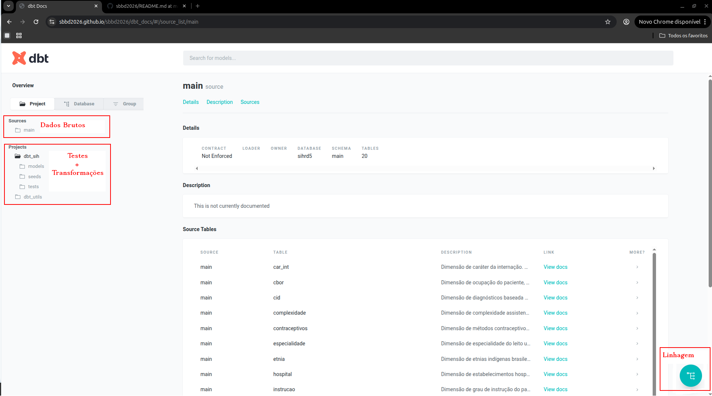
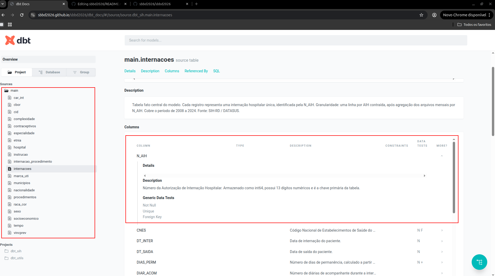
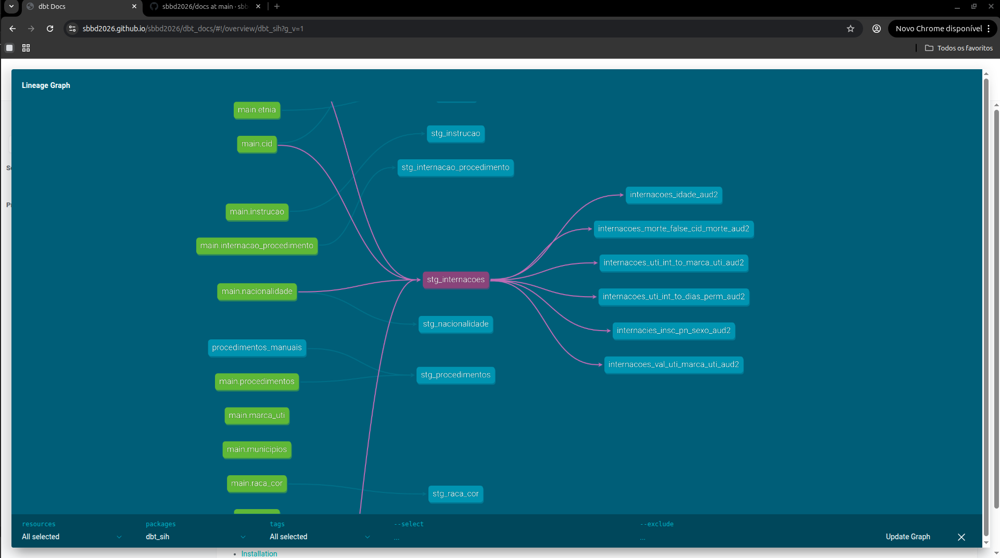
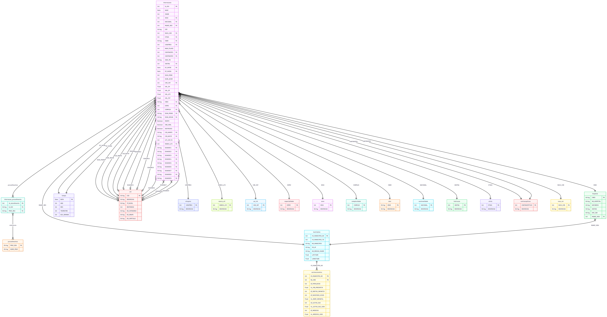
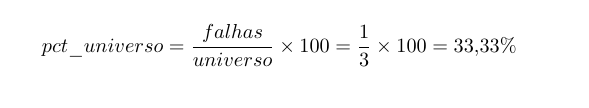

# Integração Multidimensional de Dados do SUS: Uma Abordagem ETLT com Modelagem Snowflake

> SBBD 2026
Este repositório disponibiliza os artefatos científicos do paper, organizados para garantir reprodutibilidade, rastreabilidade e navegação clara dos resultados. Correções pós-publicação estão disponíveis na [Errata](./ERRATA.md).
---

| O que você procura                        | Onde encontrar                                                                         |
|-------------------------------------------|----------------------------------------------------------------------------------------|
| Documentação dos modelos, testes e lineage| [Documentação dbt](https://sbbd2026.github.io/sbbd2026/dbt_docs/)                      |
| Diagrama do modelo OLAP                   | [Modelagem](./docs/modelagem/snowflake_schema.png)                                     |
| Dicionário de todas as tabelas            | [Dicionário de Dados](./docs/dicionario_dados.pdf)                                     |
| Log bruto do pipeline                     | [log_bruto.log](./pipeline/log_bruto.log)                                              |
| Script de extração de métricas            | [extrair_metricas.py](./pipeline/extrair_metricas.py)                                  |
| Resumo geral do pipeline                  | [resumo_pipeline.csv](./resultados/resumo_pipeline.csv)                                |
| Carga por UF                              | [carga_por_uf.csv](./resultados/carga_por_uf.csv)                                      |
| Dimensões pré T2                          | [dimensoes_pre_t2.csv](./resultados/dimensoes_pre_t2.csv)                              |
| Dimensões pós T2                          | [dimensoes_pos_t2.csv](./resultados/dimensoes_pos_t2.csv)                              |
| Testes de qualidade — Aud1                | [testes_aud1.csv](./resultados/testes_aud1.csv)                                        |
| Testes de qualidade — Aud2                | [testes_aud2.csv](./resultados/testes_aud2.csv)                                        |
| Relatório de qualidade completo           | [relatorio_qualidade.txt](./resultados/relatorio_qualidade.txt)                        |

## Documentação dbt

A documentação interativa do projeto está disponível em:
[https://sbbd2026.github.io/sbbd2026/dbt_docs/](https://sbbd2026.github.io/sbbd2026/dbt_docs/)

A seguir estão as áreas da interface utilizadas nesta pesquisa:

- **Dados Brutos (Sources):** contém as 20 tabelas do schema `main` — as fontes originais carregadas no DuckDB. As descrições das colunas e os testes declarativos (nulidade, unicidade,
relacionamento e domínio) são definidos nos arquivos `.yml`. Cada tabela documenta suas colunas com descrição, tipo e testes associados, conforme ilustrado abaixo para a tabela `main.internacoes`:

- **Projects — Regras de negócio `.sql` + Transformações T2:** contém os modelos `.sql` com as transformações do estágio T2, os testes customizados de regras de negócio em SQL e os testes declarativos `.yml` aplicados aos modelos `stg_*`.

- **Linhagem:** geração automática de um DAG com o fluxo completo dos dados, à esquerda as fontes brutas, ao centro as transformações T2 e à direita os testes realizados `.sql` em Aud2, conforme ilustrado abaixo:

## Modelagem OLAP

O modelo adota o esquema **Snowflake**, implementado no DuckDB, composto por 20 tabelas: 2 tabelas fato, 1 bridge table, 16 tabelas de dimensão e 1 dimensão derivada.

As 16 tabelas de dimensão refletem a natureza dos microdados do SIH/RD, cujas variáveis são majoritariamente categóricas e codificadas, cada domínio é normalizado em uma tabela
própria com chave primária.

O modelo é enriquecido pela tabela fato `socioeconomico`, construída a partir de cinco fontes integradas: CNES (leitos e médicos), IBGE (população e PIB per capita), SIM
(óbitos infantis) e SINASC (nascidos vivos), consolidadas em granularidade município-ano.

Ao todo, o banco antes de **T2** totaliza **398.940.744 linhas** e pós **T2** **398.940.771**. Esse incremento de 27 registros decorre da inserção estratégica de metadados via `dbt seeds` (12 registros em cid_manuais, 7 em procedimentos_manuais) e inserção via `SQL` de 8 registros sentinela nas tabelas de domínio, garantindo a integridade referencial completa do modelo.

## Qualidade dos Dados

A camada de qualidade é implementada com testes declarativos no dbt, organizados em duas auditorias: Aud1, executada sobre os dados brutos após a carga inicial, e Aud2, executada após as transformações do estágio T2. Os resultados completos de ambas as auditorias estão disponíveis em [testes_aud1.csv](./resultados/testes_aud1.csv) e [testes_aud2.csv](./resultados/testes_aud2.csv), contendo para cada teste: tipo, status (aprovado/reprovado), quantidade de registros com falha, universo de análise e percentual de erro sobre o universo.

O universo de análise representa o denominador utilizado para calcular o percentual de erro de cada teste. Ele varia conforme o contexto do teste: testes sobre tabelas de dimensão utilizam o total de registros da própria dimensão, enquanto testes sobre a tabela fato utilizam o total de internações. Por exemplo, o teste de unicidade sobre a coluna `DESCRICAO` da tabela `sexo`, que possui apenas 3 registros, falhou pois o dicionário do DATASUS registra dois códigos para o sexo feminino (`2` e `3`), resultando em descrições duplicadas. Neste caso, o universo é 3 e o percentual de erro é calculado sobre esse total, e não sobre os 197.312.203 registros de internações. A fórmula utilizada em todos os resultados e sua aplicação para o teste da tabela `sexo` são apresentadas a seguir:

  

